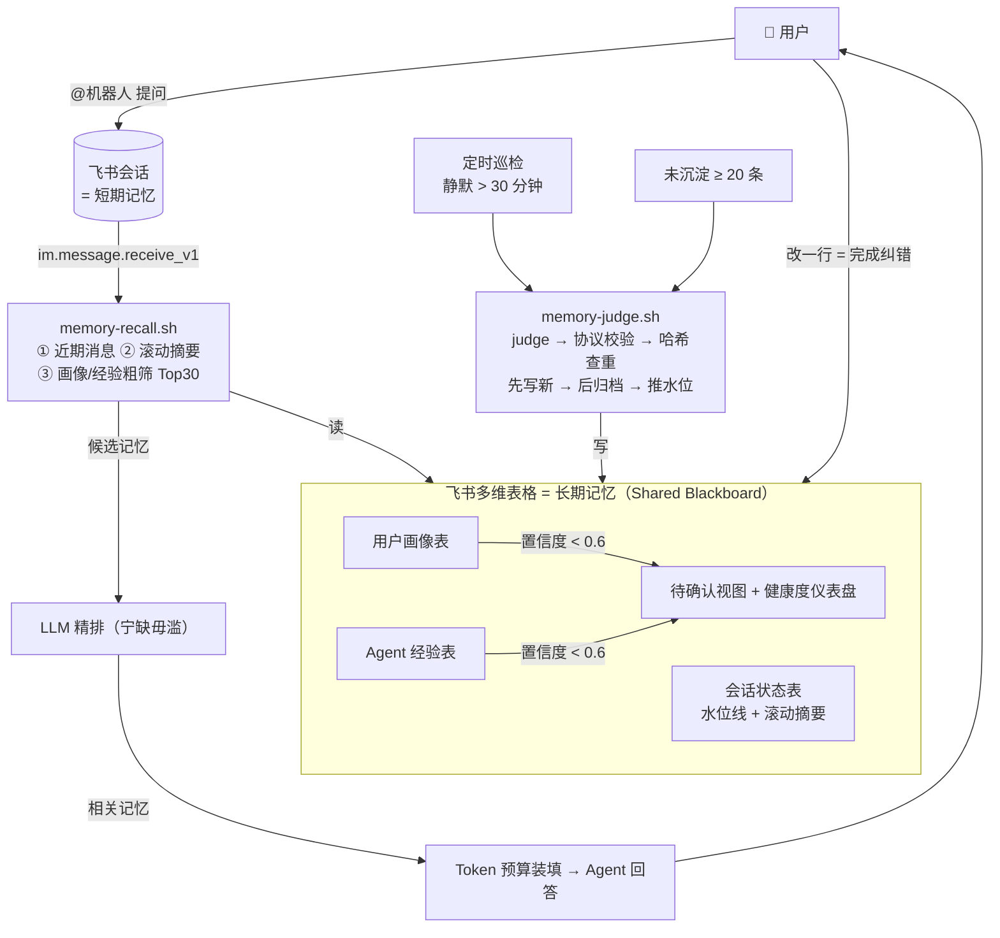

# feishu-agent-memory

> 让任意 AI Agent 在飞书里获得**跨会话记忆**——记忆存在你自己的多维表格里：
> **看得见，改得动，带得走。**

一个可安装的 [Agent Skill](skills/agent-memory/SKILL.md) + 一个飞书多维表格模板。
装到任意 agent（coding agent / Coze / Dify / 任何能调 LLM 的运行时），agent 就能在飞书会话里
"记住用户"：回答前自动召回相关记忆，会话结束后自动沉淀值得长期记住的信息。

## 解决什么问题

- **失忆**：AI 助手每次会话从零开始，用户反复交代同样的事（"回答要简洁"、"我对辣过敏"）；
- **黑盒**：通用记忆方案存在向量库里，用户看不见里面记了什么、错了没法改；
- **外挂**：协作发生在飞书，记忆却存在第三方服务里，和业务流脱节。

本方案的答案是：**记忆就是一张飞书多维表格**。会话在 IM 里，记忆在 Base 里，
人和 agent 读写的同一份数据——agent 写入，人随时查看、修改、删除，agent 下次读到的就是修正后的版本。

## 特性

- **两条链路**：读链路（召回用户画像 / 任务经验 / 会话摘要 / 近期消息注入上下文）+
  写链路（静默后 LLM 判断沉淀，哈希查重、冲突旧记忆软删归档、水位线推进）
- **协议防御**：LLM 输出走严格字段表（枚举白名单 + 数值截断），非法值降级不报错——
  任何畸形输出都不会让入库失败
- **透明治理**：每条记忆带置信度；低置信进「待确认」视图等人核对，**改一行表格 = 完成纠错**
- **事件驱动 + 双触发器**：IM 消息事件驱动读链路；定时巡检 + 未沉淀阈值触发写链路，幂等可重入
- **降级哲学**：记忆是增强能力不是主链路——Base 挂了、精排失败、消息拉不到，全部降级继续回答
- **多用户 / 多 Agent**：用户画像按用户共享（全体 agent 可读），任务经验按 Agent ID 隔离
- **观测**：`memory-stats.sh` 健康度统计 +「记忆健康度」仪表盘一键搭建（幂等）

## 架构



上半部分是**读链路**（事件驱动，回答前召回）；下半部分是**写链路**（双触发器，静默后沉淀）；
中间的飞书多维表格是人和 Agent 共同读写的黑板——低置信记忆进「待确认」视图，
人在表格里改一行即完成纠错。逐节点说明见
[docs/memory-system-design.md](docs/memory-system-design.md)。

## 快速开始

前置：[飞书](https://www.feishu.cn/) 账号、[lark-cli](https://github.com/larksuite/lark-cli)（已登录、
对目标 Base 有读写权限）、python 3.x。LLM 由你的 agent 侧承担，或按 `scripts/llm.sh.example`
接入任意 OpenAI 兼容 API。

**① 建 Base**：按 [docs/memory-system-design.md](docs/memory-system-design.md) 第 3 节建三张表
（用户画像 / Agent 经验 / 会话状态）。

**② 配置**：

```bash
cd skills/agent-memory/scripts
cp config.env.local.example config.env.local   # 填入你的 base_token 与三个表 ID（此文件不入库）
```

**③ 一键观测 + 安装**：

```bash
bash skills/agent-memory/scripts/setup-observability.sh   # 幂等：待确认视图 + 健康度仪表盘
```

然后把 `skills/agent-memory` 复制到你的 agent 的 skills 目录（如 `~/.agents/skills/`）；
不用 skill 框架的话，直接把 `skills/agent-memory/prompts/` 里的四个 Prompt 挂到 Coze / Dify 也可以。

## 日常使用

| 命令 | 作用 |
|---|---|
| `scripts/memory-recall.sh --chat-id <oc_xxx> --user-id <ou_xxx> --query "..."` | 回答前召回：输出短期消息 / 摘要 / 用户画像 / Agent 经验，附精排请求 |
| `scripts/memory-judge.sh prepare ...` → LLM → `commit ...` | 会话静默后沉淀记忆（judge → 查重 → 先写后归档 → 推水位） |
| `scripts/memory-stats.sh` | 记忆健康度日报（`--json` 可供卡片渲染 / 巡检告警） |
| `scripts/memory-consolidate.sh` | 无人值守巡检（cron 每 30 分钟，需配置 `LLM_CMD`） |

完整协议见 [references/write-protocol.md](skills/agent-memory/references/write-protocol.md)（字段表、
幂等语义、降级表）。

## 测试

```bash
bash skills/agent-memory/tests/e2e-test.sh
```

46 项端到端用例跑在你的真实 Base 上：写链路协议防御 17 项、读链路 10 项、多用户/多 Agent 隔离 3 项、
观测 5 项、幂等恢复 4 项、痛点场景 3 项（跨会话召回 / 人工纠错 / 过时记忆退场）。
测试数据自隔离（`tm*` 会话、`ou_test_*` 用户）且结束自动清理。清单见
[docs/test-matrix.md](docs/test-matrix.md)。

## 文档

- [docs/memory-system-design.md](docs/memory-system-design.md) — 完整设计：四层记忆模型、飞书映射、
  表结构定义、Prompt 全文、事件链路与调度、降级策略
- [docs/test-matrix.md](docs/test-matrix.md) — 测试矩阵与结果
- [skills/agent-memory/references/dashboard.md](skills/agent-memory/references/dashboard.md) —
  仪表盘 / 待确认视图搭建（命令行 + 界面两条路径）

## License

[MIT](LICENSE)
